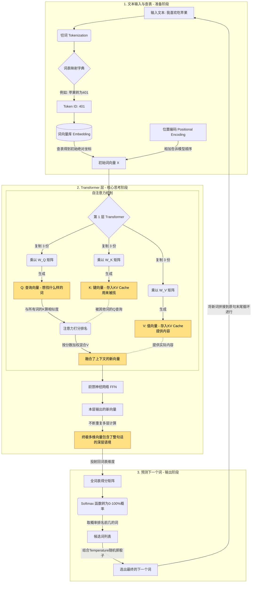

# 大语言模型 (LLM) 推理工作流

这是一张展示一个词（Token）从输入大模型，到最终生成下一个词的完整流程图。

```mermaid
graph TD
    subgraph Stage1 [1. 文本输入与查表 - 准备阶段]
        A[输入文本: 我喜欢吃苹果] --> B(切词 Tokenization)
        B --> C{词表映射字典}
        C -->|例如: 苹果转为401| D[Token ID: 401]
        D --> E[(词向量库 Embedding)]
        E -->|查表得到初始绝对坐标| F[初始词向量 X]
        PE[位置编码 Positional Encoding] -->|相加告诉模型顺序| F
    end

    subgraph Stage2 [2. Transformer 层 - 核心思考阶段]
        F --> G{第 1 层 Transformer}
        
        subgraph SelfAttention [自注意力机制]
            G -->|复制 3 份| H1(乘以 W_Q 矩阵)
            G -->|复制 3 份| H2(乘以 W_K 矩阵)
            G -->|复制 3 份| H3(乘以 W_V 矩阵)
            
            H1 -->|生成| Q[Q: 查询向量 - 想找什么样的词]
            H2 -->|生成| K[K: 键向量 - 存入KV Cache用来被找]
            H3 -->|生成| V[V: 值向量 - 存入KV Cache提供内容]
            
            Q -->|与所有词的K算相似度| AttentionScore(注意力打分排名)
            K -.-|被其他词的Q查询| AttentionScore
            
            AttentionScore -->|按分数加权混合V| ContextVector[融合了上下文的新向量]
            V -.-|提供实际内容| ContextVector
        end
        
        ContextVector --> FFN[前馈神经网络 FFN]
        FFN --> Output1[本层输出的新向量]
        
        Output1 -->|不断重复多层计算| FinalVector[终极多维向量包含了整句话的深层语境]
    end

    subgraph Stage3 [3. 预测下一个词 - 输出阶段]
        FinalVector -->|投射回词表维度| Logits[全词表得分矩阵]
        Logits --> Softmax(Softmax 函数转为0-100%概率)
        
        Softmax -->|取概率排名前几的词| Candidates[候选词列表]
        
        Candidates -->|结合Temperature随机掷骰子| NextToken[选出最终的下一个词]
        
        NextToken -->|将新词拼接到原句末尾循环进行| A
    end

    classDef highlight fill:#ffe082,color:#000000,stroke:#d4a373,stroke-width:2px;
    class Q,K,V,ContextVector,FinalVector highlight;
```
